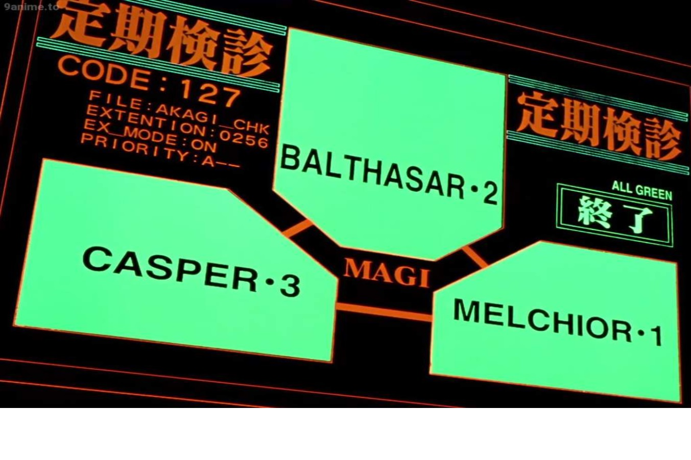

# 🔺 MAGI System v2.0


<div align="center">

</div>

---

## 🧬 What is MAGI?

**MAGI System** is a multi-agent AI inspired by the legendary supercomputers of Neon Genesis Evangelion. Three distinct AI personalities—Melchior (logic), Balthasar (ethics), Casper (practicality)—analyze every question from different angles, then synthesize their answers for a true "consensus of minds". 

> *"The truth lies in the synthesis of three perspectives."*

MAGI is the digital soul of NERV: scientific, ethical, and pragmatic. Now you can ask it anything—just like Gendo Ikari.

---

## 🚀 Quick Start

```bash
# 1. Install dependencies
pip install -r config/requirements.txt

# 2. Install LiteLLM (required for LLM provider support)
pip install litellm

# 3. Configure API keys
cp config/.env.example config/.env
# Edit config/.env with your keys

# 4. Launch web interface
python src/magi_web_interface.py
```

Open [http://localhost:7862](http://localhost:7862) in your browser.

---

## ☁️ Deploy to Hugging Face Spaces

You can deploy this app publicly in a few seconds with Gradio:

```bash
# From the project root
pip install gradio
gradio deploy
```

Notes:
- The deployment uses `app.py` (exports `app = create_magi_interface()`).
- Dependencies are taken from the root `requirements.txt`.
- Add your API keys (e.g., `GROQ_API_KEY`) as Secrets in the Space settings:
	- Go to Space → Settings → Variables and secrets → New secret.
	- Name: `GROQ_API_KEY`, Value: your key.
	- Optionally add `OPENAI_API_KEY`, `SERPER_API_KEY`.
- If you plan to use only local Ollama, you don’t need any secret, but Spaces do not provide GPU/CPU for Ollama models, so prefer Groq/OpenAI.

Troubleshooting:
- If you see “Module not found” after deploy, ensure `requirements.txt` exists in the project root and includes `gradio`, `crewai[tools]`, `python-dotenv`, and `litellm`.
- Spaces automatically runs the Gradio app; no need to call `launch()` inside `app.py`.

---

## 🛠️ Requirements

- Python 3.8+
- API Key (Groq recommended)

---

## 🔑 API Keys

- [Groq](https://console.groq.com) (recommended)
- [Serper](https://serper.dev) (optional, for search)
- [OpenAI](https://platform.openai.com) (optional)

Copy `config/.env.example` to `config/.env` and add your keys.

---

## 💻 Usage

### Web Interface
```bash
python src/magi_web_interface.py
```

### Command Line
```bash
python src/Main_core_002.py
```

---

## 🧠 How MAGI Works

1. **Ask a question** (Evangelion, AI, ethics, anything!)
2. **Choose your LLM provider** (Groq, OpenAI, or local Ollama)
3. **MAGI splits your question** into three perspectives:
	- 🔬 Melchior: Scientific/logical
	- 🛡️ Balthasar: Ethical/emotional
	- ⚖️ Casper: Practical/social
4. **Synthesis**: The system merges all three analyses for a complete answer.

---

## 🦙 Local Ollama Support

Want to run MAGI with local models? Install [Ollama](https://ollama.com/) and download your favorite model (e.g. `llama3`, `phi3`, `mistral`). Select "Ollama (local)" in the interface and enter the model name.

---

## 📜 License & Credits

Fan-made project for educational purposes.

**Neon Genesis Evangelion** © GAINAX / khara

Code: MIT License

Powered by CrewAI & Gradio

---

<div align="center">
<b>MELCHIOR-1 • BALTHASAR-2 • CASPER-3</b><br>
<b>NERV - God's in his heaven, all's right with the world</b>
</div>
